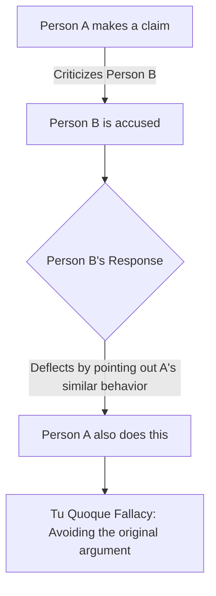

# [Tu Quoque](https://en.wikipedia.org/wiki/Tu_quoque)

- Avoiding having to engage with criticism by turning it back on the accuser - you answered [criticism](https://en.wikipedia.org/wiki/Criticism) with criticism.
- Pronounced too-kwo-kwee. Literally translating as 'you too' this fallacy is also known as the appeal to hypocrisy. 
- It is commonly employed as an effective [red herring](https://en.wikipedia.org/wiki/Red_herring) because it takes the heat off someone having to defend their argument, and instead shifts the focus back on to the person making the criticism.

!!! example "Example of Tu Quoque"
    When accused of not recycling properly, John responded by pointing out that his critic also does not recycle, thereby committing a tu quoque fallacy by diverting the criticism and attacking the critic's behavior instead of addressing the issue at hand.

