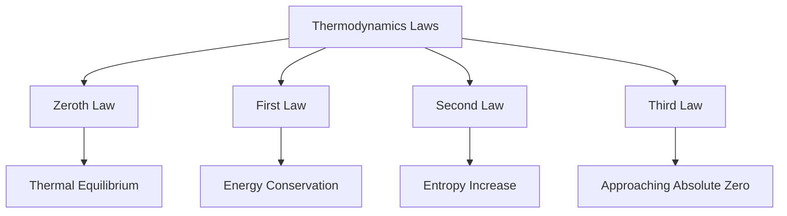

| Law | Description |
| :--- | :--- |
| 0th | If two systems are each in [thermal equilibrium](https://en.wikipedia.org/wiki/Thermal_equilibrium) with a third system, they are in thermal equilibrium with each other.|
| 1st | Energy cannot be created or destroyed, only transformed from one form to another ([conservation of energy](https://en.wikipedia.org/wiki/Conservation_of_energy)).|
| 2nd | In any energy exchange, if no energy enters or leaves the system, the potential energy of the state will always be less than that of the initial state ([entropy](https://en.wikipedia.org/wiki/Entropy)).|
| 3rd | As the temperature of a system approaches [absolute zero](https://en.wikipedia.org/wiki/Absolute_zero), the entropy of the system approaches a minimum value.|

- The laws of thermodynamics describe energy in a closed system. 
- Thermodynamic laws cannot be escaped and underlie the physical world. 
- They describe a world in which useful energy is constantly being lost, and energy cannot be created or destroyed. 
- Applying their lessons to the social world could make you bank eg. [Tesla](https://www.tesla.com/en_my).

!!! example "Example of The Law of Thermodynamics"
    A cup of hot coffee left in a cold room eventually cools down to room temperature. This describes the second law of thermodynamics by demonstrating the natural tendency of heat to flow from a hotter object to a colder one.