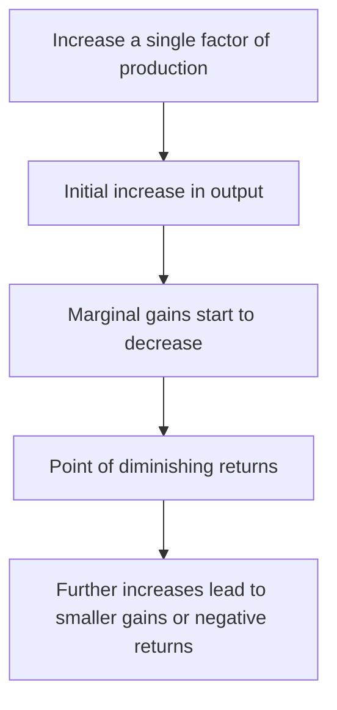

# [Law Of Diminishing Returns](https://www.investopedia.com/terms/l/lawofdiminishingmarginalreturn.asp)

Related to scale, most important real-world results are subject to an eventual decrease of incremental value. 
Often, the law of diminishing returns veers into negative territory – i.e., receiving too much money could destroy the person / organization 

!!! example "Example of Law of Diminishing Returns"
    Give a poor person enough money to thrive, and they are no longer poor. 
    But after a certain point, additional money will not improve their lot; there is a clear diminishing return of additional dollars at some roughly quantifiable point. 

