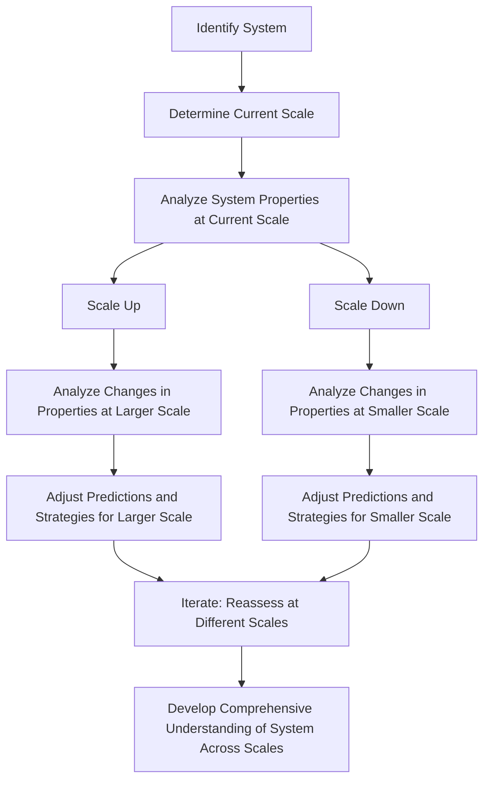

# [Scale](https://en.wikipedia.org/wiki/Scale_(ratio))

- One of the most important principles of systems is that they are sensitive to scale. 
- The behaviours of scale tend to change when you scale them up or down. 
- In studying complex systems, we must always be roughly quantifying – in orders of magnitude, at least – the scale at which we are observing, analyzing, or predicting the system.

!!! example "Example of Scale"
    When building a city, we have to assesses how different scales of development, from neighborhood blocks to entire districts, affect traffic, housing density, and public amenities, adjusting plans accordingly for each scale. Understand that the patterns of transportation, energy consumption and population densities change the dynamic and effeciency of building infrastructure.