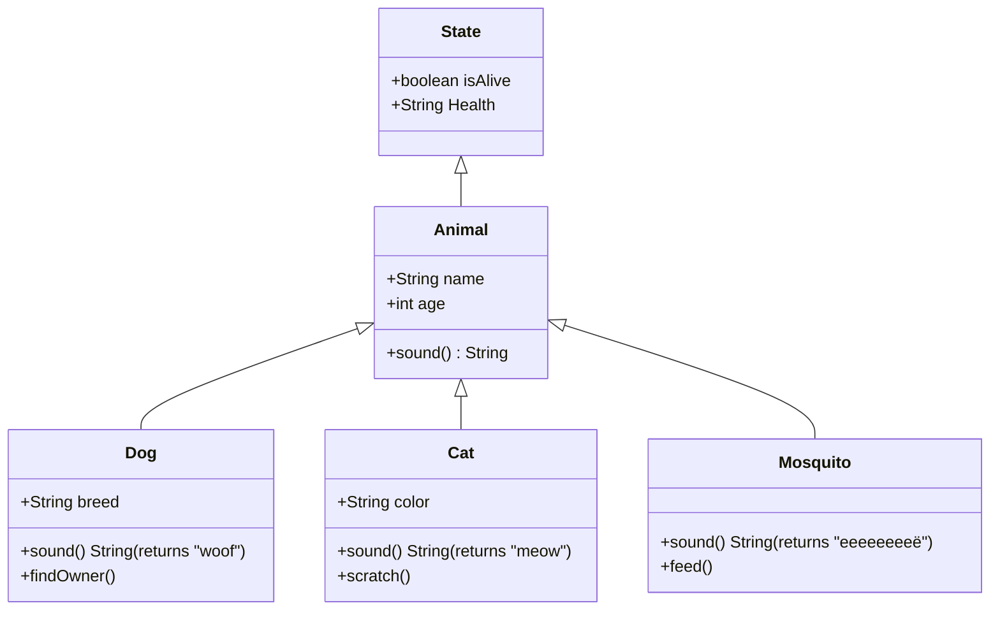

Here's a [thought experiment](https://hipersayanx.blogspot.com/2012/12/object-oriented-programming-in-bash.html) -  you can only program in bash, and you have been assigned a task that demanded you to model your program with behaviors that could be easily modeled with objects eg. an airplane or a car (you get the idea). Imagine the complexities that might arise from a command-styled, procedurally programmatic language like bash to define the modularity, components, and properties of a vehicle.

Well, driven by my curiosity and lots of free time, I sought to explore how we might go about implementing object-oriented programming in bash.

### Object Oriented Programming Principles 

Object-Oriented Programming (OOP) is a paradigm that uses "objects" to design applications. These objects bundle related data, known as state, and methods to manipulate this data, known as behavior. Objects interact via message passing which invokes methods, allowing dynamic behavior. OOP is implemented using techniques like [dynamic dispatch](https://en.wikipedia.org/wiki/Dynamic_dispatch) and [closures](https://simple.wikipedia.org/wiki/Closure_(computer_programming)). Behaviors are defined in a class but executed at runtime. A key requirement for OOP is lexical scoping, which allows a function to access variables from its enclosing scope. Without it, OOP implementation becomes challenging.

### Object Oriented Example

> Below shows a class diagram that illustrates a [PlantUML](https://en.wikipedia.org/wiki/PlantUML) example of how we can apply the OOP Principles

In our UML Diagram, a base class Animal with subclasses Dog, Cat, and Mosquito inherits from Animal and overrides the sound method. The State class is associated with the Animal class and has two properties: isAlive and Health. This class represents the state of an animal, indicating whether it's alive and its health status. 



### Experimentation 
> [Compgen](https://www.gnu.org/software/bash/manual/html_node/Programmable-Completion-Builtins.html) is used as a command in Unix-like operating systems, to generate possible completions for commands and filenames. For example, running compgen -c will list all the available commands, while compgen -f will generate a list of filenames in the current directory.


We utilize a `this` variable to declare a [pointer](https://en.wikipedia.org/wiki/Pointer_(computer_programming)#:~:text=Pointers%20are%20used%20to%20pass,multiple%20values%20from%20a%20function.) variable which we could then use to initialize a static member function, The constructor can be called with the `1$` which references itself and performs the memory allocation before it has been completely initialized for future classes or functions that have not yet been created. We can utilize the built-in `export` keyword in bash to create variables that can be accessed through the child processes created by the subsequent scripts. By utilizing compgen, we could enable bash files to inherit methods between files, allowing the program execution to access the built-in methods of the class. This allows for methods to [dynamic bind](https://en.wikipedia.org/wiki/Late_binding) explicitly to another class and allows for the method cast to be called.

> Class structure setup by simulating the _this keyword.

Heres an example:

```bash 
#!/bin/bash

function name() {
    # Pointer to the base state class
    base=$FUNCNAME
    this=$1

    # Variable properties
    export ${this}_var1=$2
    export ${this}_var2=$3
    export ${this}_var3=$4

    # Declare methods of base class 
    for method in $(compgen -A function)
    do
        export ${method/#$base\_/$this\_}="${method} ${this}"
    done

}
```

##### Project Setup 
```bash
# create object files and make them executable
touch state.sh animal.sh main.sh
chmod +x state.sh animal.sh main.sh
```

> Getting Animal to inherit from State. Consider state.sh as a base class file to define a state object.

Based on our UML diagram, we need to create a base class called State. through the OOP concept of [inheritence](https://en.wikipedia.org/wiki/Inheritance_(object-oriented_programming)), we want the attributes of the State class to be inherited from the Animal class and the animals we create later in the application to all inherit from the state class. This means each Animal will have a boolean attribute `isAlive` and a String attribute `Health` indicating their current state.

##### [state.sh]()
```bash 
#!/bin/bash 

# Base state class
function State() {
    # Pointer to the base state class
    base=$FUNCNAME
    this=$1

    # Declare state properties
    export ${this}_isAlive=$2 # boolean value
    export ${this}_Health=$3 # String value

    # Declare methods of base class 
    for method in $(compgen -A function)
    do
        export ${method/#$base\_/$this\_}="${method} ${this}"
    done

    state=$(eval "echo \$${this}_isAlive")
}

# Display human readable representation of the state of the animal
function State_show() {

    # Obtain reference from base class
    base=$(expr "$FUNCNAME" : '\([a-zA-Z][a-zA-Z0-9]*\)')
    this=$1

    # Retrieve base components
    isAlive=$(eval "echo \$${this}_isAlive")
    Health=$(eval "echo \$${this}_Health")

    echo "State_show() -> $this ($isAlive, $Health)"
}

```

> Testing inheritance in the Animal class and defining the attributes 

We create an Animal class to test the inheritance of the state object, for testing purposes we utilize the animal class to create animal states for dog, cat and mosquito. As you can see, the state functions and variables can be invoked in the animal class. This proves that [lexical scoping](https://en.wikipedia.org/wiki/Scope_(computer_science)#Lexical_scope) can be achieved by calling the state variables with an underscore eg. `_isAlive` or `_animalState`. 

##### [animal.sh]()

```bash
#!/bin/bash 

# import state object 
. state.sh

# Defining base class 
function Animal() {
    
    # A pointer to the Animal class
    base=$FUNCNAME
    this=$1

    # Inherited classes (eg State)
    export ${this}_inherits="dogState, catState, mosquitoState" # (3.1)

    for class in $(eval "echo \$${this}_inherits")
    do
        for property in $(compgen -A variable ${class}_)
        do
            export ${property/#$class\_/$this\_}="${property}" # (3.2)
        done

        for method in $(compgen -A function ${class}_)
        do
            export ${method/#$class\_/$this\_}="${method} ${this}"
        done
    done

    # creating default states for all the animals
    State "dogState" true "healthy"
    State "catState" true "obese"
    State "mosquitoState" false "splattered"

    # Test animal state variables
    echo "Animal state variable properties : 
                dogState ($dogState_isAlive, $dogState_Health), 
                catState ($catState_isAlive, $catState_Health), 
                mosquitoState ($mosquitoState_isAlive, $mosquitoState_Health)"

    # Test animal state methods
    echo "Animal base state methods :"
    $dogState_show
    $catState_show
    $mosquitoState_show
}

Animal
```

>output from animal.sh (reformatted to show property and method data)

The data can be transiently accessed through the animal class, which means that theoretically, we can abstract the animal into other classes eg. dog.sh, cat.sh or mosquito.sh.

```bash
./animal.sh

Animal state variable properties : 
                dogState (true, healthy), 
                catState (true, obese), 
                mosquitoState (false, splattered)

Animal base state methods :
                Health Status -> dogState (true, healthy)
                Health Status -> catState (true, obese)
                Health Status -> mosquitoState (false, splattered)
```

---

### Creating Animal Objects - Implementation 

File Structure
```bash
animal
    ├── state.sh
    ├── animal.sh
    └── main.sh
```

> Rewriting the animal class into an abstract class.

Now by utilizing the same idea as `State()` we can simulate the same idea of creating the inheritnace of our animal attributes using the `_this` keyword and `compgen`. Abstract classes are designed to be a generalization of animals, and it is not meant to be instantiated on their own. Instead, it serves as a blueprint for more specific classes, often called concrete classes eg. `Dog()`, `Cat()`, `Mosquito()`, which inherit from the Animal class.

##### [animal.sh]()

```bash
#!/bin/bash 

# import state object 
. state.sh

# Defining base class 
function Animal() {
    
    # A pointer to the Animal class
    base=$FUNCNAME
    this=$1

    # Inherited classes (eg State)
    export ${this}_inherits="dogState, catState, mosquitoState" # (3.1)

    for class in $(eval "echo \$${this}_inherits")
    do
        for property in $(compgen -A variable ${class}_)
        do
            export ${property/#$class\_/$this\_}="${property}" # (3.2)
        done

        for method in $(compgen -A function ${class}_)
        do
            export ${method/#$class\_/$this\_}="${method} ${this}"
        done
    done

    # Declare animal properties 
    export ${this}_sound=$2
    export ${this}_age=$3
    export ${this}_animalState=$4
    export ${this}_isAlive=$5
    export ${this}_Health=$6

    # Declare animal methods
    for method in $(compgen -A function)
    do
        export ${method/#$base\_/$this\_}="${method} ${this}"
    done
}

# Defining animal sound property
function sound() {
    # Obtaining reference from base class 
    base=$(expr "$FUNCNAME" : '\([a-zA-Z][a-zA-Z0-9]*\)')
    this=$1

    # Retrieve base compenents
    animal_sound=$(eval "echo \$${this}_sound")
    echo "$this a dog says $animal_sound"    
}

```

To demonstrate the simulation of inheriting from an abstract class, I will generalize the application layer into a main file called `main.sh`. The methods and attributes of our abstract class `Animal()` has been inherited and are accessible to our concrete class. This theoretically implies that we can also utilize OOP concepts such as polymorphism and Encapsulation to manipulate our programs through base Inheritance and Abstraction. 

##### [main.sh]() 

```bash
#!/bin/bash 

# import state and animal objects
. state.sh
. animal.sh 

function main() {
    # Create animal objects
    # Animal 'animal_type' 'animal_type_sound' 'animal_type_age' 'animal_type_stateid' 'animal_isAlive' 'anial_health'
    Animal 'dog' 'woof' 12 'dogState' true 'healthy'
    Animal 'cat' 'meow' 9 'catState' true 'obese'
    Animal 'mosquito' 'eeeeeeë' 0.5 'mosquitoState' false 'splattered'

    # display inherited states 
    echo "dog ($dog_sound, $dog_age, $dog_dogState, $dog_isAlive, $dog_Health)"
    echo "cat ($cat_sound, $cat_age, $cat_catState, $cat_isAlive, $cat_Health)"
    echo "mosquito ($mosquito_sound, $mosquito_age, $mosquito_mosquitoState, $mosquito_isAlive, $mosquito_Health)"
}

main
```

>output from main.sh (simulated as a general environment to create object classes)

The abstract class data of animal can be accessed transiently in our main function and used to initialize different animals.

```
./main.sh 
dog (woof, 12, , true, healthy)
cat (meow, 9, , true, obese)
mosquito (eeeeeeë, 0.5, , false, splattered)
```

---

#### In Conclusion 

> "If you have to write bash functions, you might as well write it in [Python](https://www.python.org/) or [Golang](https://go.dev/)" 

Bash is painful to write unless you're using it to mock up a procedural, command-styled setup or linker script - it's not worth trying to model Minecraft using pure bash. While the ideas I've proposed are theoretically possible and can be simulated using bash utils - and the idea of writing fully-fledged OO scripts in CICD processes might be tempting, but [the juice is simply not worth the squueze](https://www.urbandictionary.com/define.php?term=The%20juice%20is%20worth%20the%20squeeze). 


##### Resources 

1. [Original article that inspired the idea](https://gist.github.com/leandronsp/5e7c94ee5b4ea53ed28e9824ca8e243e)
2. [Custom useful bash libraries](https://github.com/juan131/bash-libraries)
3. [Wikipedia to study OO concepts](https://en.wikipedia.org/wiki/Object-oriented_programming)